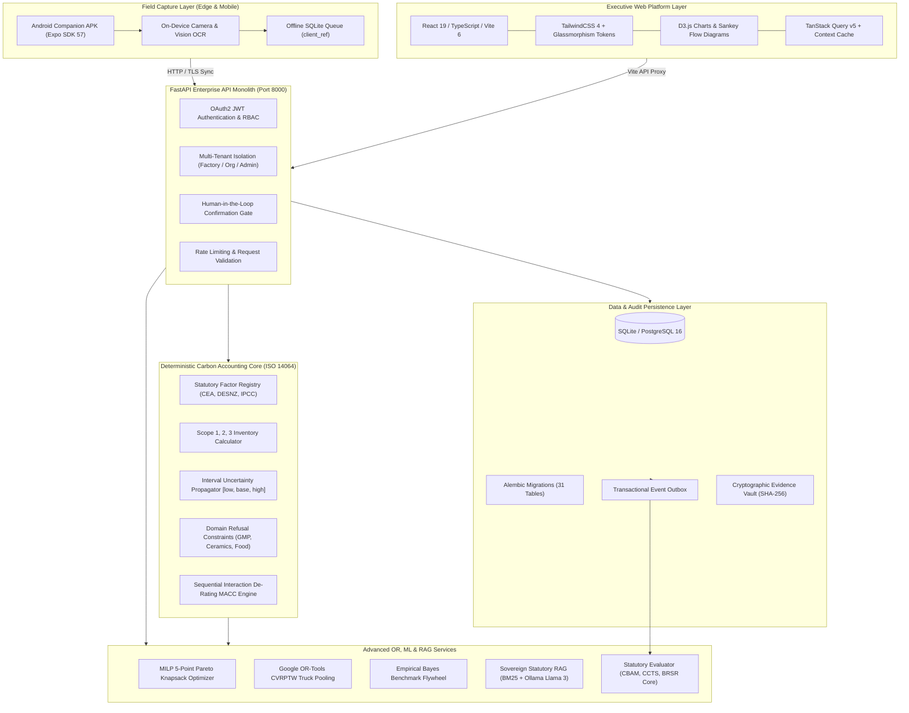

<div align="center">

# ⚡ PRANGARA (प्रांगार)
### Industrial Carbon Intelligence & Autonomous Decarbonization Operating System

*HackOut'26 · Problem Statement PS10*  
**Industrial Emission Leak-Point Detector & Circular Alternative Recommender**

[](https://python.org/)
[](#-rest-api-architecture--endpoints)
[](src/)
[](src/)
[](apps/mobile/)
[](RELEASE.md)
[](#-test-suites--verification)
[](#-data-provenance--cryptographic-authenticity)
[](docs/PRD.md)
[](LICENSE)

<br/>

> **"Lead with Rupees, Close with Tonnes."**  
> An Indian industrial SME enters 10 routine numbers from monthly utility invoices and production ledgers.  
> **PRANGARA** computes an audit-grade Scope 1, 2, and 3 footprint with interval uncertainty, isolates benchmark-relative carbon leaks, solves a multi-objective Pareto knapsack for capital allocation, pools logistics with neighboring factories, and generates a cash-positive, statutory-compliant decarbonization roadmap.

---

</div>

## 📌 Table of Contents

- [The Core Challenge & Problem Statement (HackOut'26 PS10)](#-the-core-challenge--problem-statement-hackout26-ps10)
- [Why PRANGARA? The Neuro-Symbolic Philosophy](#-why-prangara-the-neuro-symbolic-philosophy)
- [Team PRANGARA (HackOut'26)](#-team-prangara-hackout26)
- [System Architecture](#-system-architecture)
- [Comprehensive Technology Stack](#-comprehensive-technology-stack)
- [The 10 Core Functional Modules](#-the-10-core-functional-modules)
- [Advanced Operations Research & ML Optimizers](#-advanced-operations-research--ml-optimizers)
- [10 Supported Industrial Sectors & Demo Plants](#-10-supported-industrial-sectors--demo-plants)
- [Hero Plant Case Study — Tirupur Dyeing Facility](#-hero-plant-case-study--tirupur-dyeing-facility)
- [REST API Architecture & Endpoints](#-rest-api-architecture--endpoints)
- [Data Provenance & Cryptographic Authenticity](#-data-provenance--cryptographic-authenticity)
- [Quick Start Guide](#-quick-start-guide)
- [Test Suites & Verification](#-test-suites--verification)
- [Repository Structure](#-repository-structure)
- [Claim Boundary & Regulatory Disclaimer](#-claim-boundary--regulatory-disclaimer)

---

## 🎯 The Core Challenge & Problem Statement (HackOut'26 PS10)

India is home to over **63 million Micro, Small, and Medium Enterprises (MSMEs)** accounting for ~30% of national GDP and 45% of manufacturing exports. As global supply chains decarbonize, Indian manufacturers face an unprecedented wave of statutory compliance and commercial deadlines:

1. **EU Carbon Border Adjustment Mechanism (EU CBAM):** Definitive tariff regime active since 2026. Indian exporters of steel, aluminium, cement, and textiles face punitive carbon tariffs at European ports unless verifiable, audit-grade emissions data is provided.
2. **SEBI BRSR Core (Business Responsibility and Sustainability Reporting):** The Securities and Exchange Board of India mandates top 1,000 listed corporations to conduct mandatory reasonable assurance audits on their value chain (Scope 3) suppliers.
3. **BEE Carbon Credit Trading Scheme (CCTS) & PAT:** The Bureau of Energy Efficiency establishes mandatory emission targets and domestic carbon credit markets across energy-intensive industrial clusters.
4. **Green Finance Lending Covenants:** Public sector and private commercial banks offer 50–125 bps interest rate concessions on capex loans contingent upon verifiable greenhouse gas reductions.

### The MSME Dilemma

* **Invisible Scope 3 Emissions:** Factory owners typically assume emissions come only from their boiler chimneys or electricity meters. In reality, **60% to 75% of an industrial SME's carbon footprint is embedded upstream in raw material purchases** (virgin cotton yarn, steel billets, polymer granules, chemical intermediates) that never show up on an electricity bill.
* **Generic Advice Without Economics:** Advising an MSME to "install rooftop solar" or "switch to electric furnaces" without a balance-sheet business case is futile. Presenting an actionable proposition — *"₹2.17 Cr CapEx, 14-month payback, saves ₹82 Lakhs/year in operating costs, eliminates 367 tCO₂e/year with zero production downtime"* — secures immediate boardroom approval.
* **Zero Hallucination Tolerance:** Carbon accounts are statutory documents submitted to customs authorities, banks, and carbon verifiers. Generative AI estimation is strictly inadmissible. Calculations must be **100% mathematically deterministic** under ISO 14064 and the GHG Protocol Corporate Standard.

---

## 💡 Why PRANGARA? The Neuro-Symbolic Philosophy

PRANGARA resolves the conflict between mathematical rigor and intelligent automation through a **Neuro-Symbolic Architecture**:

```
 ┌────────────────────────┐       ┌────────────────────────┐       ┌────────────────────────┐
 │   1. FACTORY INTAKE    │       │ 2. DETERMINISTIC CORE  │       │  3. ADVANCED ML & OR   │
 │ Direct Monthly Metrics │ ────> │  Scope 1/2/3 Inventory │ ────> │ Multi-Objective Pareto │
 │ 10 Simple Numbers      │       │  Peer-Relative Leaks   │       │ CVRPTW Truck Pooling   │
 └────────────────────────┘       └────────────────────────┘       └────────────────────────┘
                                                                               │
                                                                               ▼
 ┌────────────────────────┐       ┌────────────────────────┐       ┌────────────────────────┐
 │  6. STATUTORY AUDIT    │       │  5. VERIFIABLE RAG     │       │  4. CIRCULAR ACTIONS   │
 │ CBAM, CCTS & BRSR Core │ <──── │ SHA-256 Primary Badges │ <──── │ 30 Refusal-Constrained │
 │ High-Assurance Ready   │       │ CEA / DESNZ / IPCC / BEE│       │ Marginal Abatement MACC│
 └────────────────────────┘       └────────────────────────┘       └────────────────────────┘
```

1. **Deterministic Sovereign Core (Zero-LLM Math):** All carbon math (Scope 1 direct emissions, Scope 2 location/market-based electricity, Scope 3 upstream LCA, and Marginal Abatement Cost Curves) is calculated with closed-form deterministic arithmetic. Factors are pinned to official gazettes (CEA v22, UK DESNZ 2026, IPCC 2019, BEE).
2. **Benchmark-Relative Quantitative Leak Detection:** Leaks are identified relative to peer cluster distributions ($p_{25}, p_{50}, p_{75}$), isolating anomalies via three formal rules: *Benchmark Breach* ($> p_{75}$), *Material Concentration* ($> 15\%$ of footprint at $> p_{50}$ intensity), and *Structural Hotspots*.
3. **Physical Engineering Refusal Rules:** Real industrial plants have hard engineering constraints. PRANGARA hardcodes domain refusals to eliminate invalid recommendations:
   * *Prohibits recycled blister foil* in GMP Pharmaceutical packaging (patient safety & cross-contamination violation).
   * *Prohibits biomass briquettes* in Morbi Vitrified Tile kilns (flue gas ash deposits ruin high-gloss tile glaze).
   * *Caps recycled cotton yarn at 25%* in spinning mills (staple fiber length shortens with recycling passes, weakening yarn tensile strength).
4. **Sequential Interaction De-Rating:** When multiple interventions address the same process or meter, their savings are not purely additive. PRANGARA simulates sequential load interactions where each subsequent intervention acts only on the *residual load*, preventing double-counted carbon savings.
5. **Interval Uncertainty Arithmetic:** Factors carry statutory low, base, and high bounds (`Band [low, base, high]`). Headline results declare calibrated uncertainty: *e.g., 24,069 tCO₂e (19,414 – 29,492, ±20.9%)*.
6. **Empirical Bayes Dynamic Benchmark Flywheel:** As new factories join, cluster benchmarks update via Bayesian shrinkage ($n / (n + 8)$) with Interquartile Range (IQR) outlier filtering, preventing data poisoning while improving local accuracy.

---

## 👥 Team PRANGARA (HackOut'26)

Built with precision for Indian industrial decarbonization by **Team PRANGARA**:

| Member | Role | Core Focus & Responsibilities | Key Deliverables |
|:---|:---|:---|:---|
| **Ved Sharma** | **Backend & Platform Architecture Lead** | Python / FastAPI Platform, Database Architecture, Enterprise Security, Event Streaming, CI/CD | 84 FastAPI REST endpoints, 31 SQLAlchemy/Alembic tables, JWT/RBAC security, Transactional Event Outbox, 206 pytest suite |
| **Harshil Patel**<br/>([@Destroyerved](https://github.com/Destroyerved)) | **Intelligence, OR & Carbon Engine Lead** | Deterministic ISO 14064 Engine, Mathematical Optimization, Operations Research, Sovereign RAG | ISO 14064 / GHG Protocol engine, MILP knapsack solver, Google OR-Tools CVRPTW freight pooling, Bayes benchmark flywheel |
| **Rudra**<br/>([@rudra129-lgtm](https://github.com/rudra129-lgtm)) | **Web Platform & Design Systems Lead** | Modern Web Experience, Data Visualization, Design Tokens, Spatial UX, Responsive Architecture | React 19 / TypeScript 5.8 dashboard, D3.js interactive charts, Sankey energy flows, glassmorphism design system |
| **Mehul** | **Mobile APK & Industrial Edge AI Lead** | React Native / Expo Companion App, Edge OCR, Offline Queue, Mobile Security & Hardware Integration | Standalone Android APK (v0.2.0), Hermes engine, on-device bill/nameplate OCR, offline queue idempotency (`client_ref`) |

---

## 🏗️ System Architecture

PRANGARA is architected as an industrial-grade, multi-surface system designed for low-connectivity factory environments as well as executive boardrooms:



---

## 💻 Comprehensive Technology Stack

| Layer | Technologies | Version / Spec | Purpose & Details |
|:---|:---|:---|:---|
| **Core Backend** | Python, FastAPI, Starlette | 3.11+, 0.115+ | High-performance asynchronous API platform; 84 endpoints, OpenAPI 3.1 |
| **ORM & Database** | SQLAlchemy, Alembic, PostgreSQL / SQLite | 2.0.38, 1.14+ | 31 normalized tables; multi-tenant row-level access control; audit trails |
| **Carbon Engine** | Pure Python (Deterministic) | ISO 14064-1 | Zero-LLM math; CEA v22, DESNZ 2026, IPCC 2019, BEE data sources |
| **Operations Research** | Google OR-Tools, SciPy, NumPy | 9.8+, 1.13+ | CVRPTW freight pooling, MILP knapsack solver, Empirical Bayes shrinkage |
| **AI / NLP & RAG** | Ollama, Llama 3, Gemma, BM25 | Local / Offline | Grounded statutory Q&A, anti-hallucination refusal, conversational intake |
| **Web Frontend** | React, TypeScript, Vite | 19.0, 5.8, 6.0 | Production SPA; fast HMR, strict typing, responsive enterprise dashboard |
| **Styling & UI** | TailwindCSS, Lucide, Radix Primitives | 4.0, 1.0+ | Sleek industrial dark mode, glassmorphism tokens, accessible components |
| **Data Visualization** | D3.js, React Native SVG | 7.9+ | Interactive MACC curves, Scope 1/2/3 Sankey flows, benchmark quartiles |
| **Mobile App** | Expo, React Native, Hermes Engine | SDK 57, 0.86 | Standalone Android release APK; factory-floor high-contrast design |
| **Mobile Storage** | Expo SQLite, AsyncStorage | Local Storage | Offline mutation queue with idempotent `client_ref` delivery |
| **Document Processing** | Tesseract OCR, RegEx Extractors, pdfminer | Multi-engine | Electricity bill parser, diesel receipts, motor nameplate OCR |

---

## 🚀 The 10 Core Functional Modules

### 1. Smart Intake & Autonomous Vision Extraction
* **Bill & Invoice OCR:** Scans monthly utility bills (electricity, piped natural gas, high-speed diesel) and production tally sheets. Uses targeted regex and structural parsing to extract consumption quantities, billing periods, and contracted demand.
* **Equipment Nameplate OCR:** Captures motor, boiler, and compressor nameplates from camera feeds. Extracts kilowatt ratings, RPM, frame size, and efficiency classes (IE1 vs IE3/IE4).
* **Conversational Intake:** Factory managers describe their operations in plain English or Hinglish (*"We run a 10-tonne stenter 20 hours a day using Indonesian coal and draw 45,000 units from the grid"*). The system structures the input into typed plant profiles.
* **Human-in-the-Loop Verification Protocol:** AI extraction never writes directly to the factory record. All parsed data is placed in a staging queue where the plant engineer reviews, modifies, and formally confirms the records before committing to the database.

### 2. Deterministic Scope 1, 2, and 3 Accounting Engine
* **Scope 1 (Direct Combustion):** Fuel combustion in stationary boilers, thermic fluid heaters, kilns, and diesel generators. Employs statutory gross and net calorific values (NCV) from CEA and IPCC 2019.
* **Scope 2 (Grid Electricity):** Regional grid emission factors from CEA CO₂ Baseline Database v22 (e.g., Southern Regional Grid vs National Grid average), supporting captive solar and Open Access wheeling adjustments.
* **Scope 3 (Upstream LCA & Value Chain):** Cradle-to-gate lifecycle inventories for primary materials (virgin polyester, cotton yarn, pig iron, cement clinker, polymer resins) based on worldsteel, IAI, and PlasticsEurope datasets.
* **Interval Uncertainty Engine:** Every emission factor carries verified `[low, base, high]` bounds. The engine computes strict interval arithmetic bounds across all scopes, providing auditors with confidence bands.

### 3. Quantitative Leak-Point Detection
PRANGARA identifies operational inefficiencies by comparing plant metrics against regional peer distributions ($p_{25}, p_{50}, p_{75}$):
* **Rule 1 — Benchmark Breach:** Specific energy or carbon intensity exceeding the 75th percentile of peer facilities ($> p_{75}$).
* **Rule 2 — Material Concentration:** Any single input stream accounting for $> 15\%$ of total facility emissions while operating above the median ($> p_{50}$).
* **Rule 3 — Structural Hotspots:** Severe Scope 3 supply-chain vulnerabilities where upstream embedded carbon outstrips operational emissions.

### 4. Marginal Abatement Cost Curve (MACC) & Refusal Rules
* **Financial Engineering:** Evaluates interventions using Capital Recovery Factor (CRF) annualized CapEx, net OpEx delta, and Levelized Cost of Abatement (LCOA in ₹/tCO₂e).
* **Sequential Interaction De-Rating:** Interventions targeting common equipment (e.g., waste heat recovery + VFDs on blowers + premium IE4 motors) are de-rated sequentially to prevent double-counting.
* **Hard Domain Refusals:** Refuses mathematically attractive but physically impossible interventions (e.g., capping recycled fiber in ring-spinning mills; barring briquette combustion in vitrified ceramic kilns).

### 5. Mixed-Integer Linear Programming (MILP) Knapsack Solver
* Solves the 0/1 multi-objective knapsack problem under strict capital budget limits and maximum payback horizon constraints.
* Generates a **5-point monotonic Pareto optimal frontier** across budget tiers (20%, 40%, 60%, 80%, 100%), allowing CFOs to balance capital expenditure against statutory compliance requirements.

### 6. Green Logistics & CVRPTW Multi-Tenant Freight Pooling
* Formulates regional logistics consolidation using Google OR-Tools Capacitated Vehicle Routing Problem with Time Windows (CVRPTW).
* Consolidates Less-Than-Truckload (LTL) shipments across neighboring factories into high-efficiency vehicles (e.g., 28-tonne Euro-VI trucks), achieving **$\ge 20\%$ emission cuts**.
* Evaluates 4 distinct route dispatch profiles: `Fastest`, `Cheapest`, `Lowest Carbon`, and `Balanced`.
* Identifies circular backhaul opportunities to eliminate empty return trips.

### 7. Circular Marketplace & Industrial Symbiosis
* Matches industrial waste byproducts (e.g., boiler fly ash, spent foundry sand, textile fabric scraps, agricultural bagasse) with regional off-takers (cement plants, brick kilns, recycled yarn spinners).
* Delivers multi-attribute quote comparison with weighted scoring: Net Carbon ROI (40%), Cost Savings (30%), Vendor Trust Score (15%), and Digital Product Passport Verification (15%).

### 8. Statutory Compliance Evaluator & Working Papers
* Built-in rule-pack evaluation for **EU CBAM** (CN code-level specific embedded emissions), **India CCTS** (BEE carbon credit entitlement/liability), and **SEBI BRSR Core** (Scope 1, 2, 3 indicators and energy intensity metrics).
* Generates audit-grade PDF and HTML working paper reports complete with vector SVG MACC curves, peer benchmarks, and full factor citations.

### 9. Grounded Sovereign RAG Assistant with Anti-Hallucination Badges
* Natural language assistant grounded in statutory gazettes and regulatory frameworks (BEE Energy Conservation Act, EU CBAM Guidance, SEBI BRSR Guidelines).
* Employs hybrid BM25 and vector retrieval. Every returned answer carries an official citation badge backed by a verifiable 64-character SHA-256 hash.
* Strictly rejects out-of-domain or ungrounded queries with clean refusal responses.

### 10. Multi-Tenant Enterprise Security & Audit Vault
* Role-Based Access Control (RBAC) supporting Platform Admin, Organization Owner, Facility Plant Engineer, and Third-Party Auditor roles.
* Granular per-factory access grants with automatic expiry dates.
* Strict tenant isolation: cross-tenant access attempts return 404 (never 403) to prevent resource enumeration.
* Cryptographic Evidence Vault: stores uploaded utility bills and lab test reports with SHA-256 deduplication and tamper detection.
* Transactional Event Outbox: guarantees at-least-once event delivery for downstream notifications and audit logging.

---

## 🔬 Advanced Operations Research & ML Optimizers

### 1. The Multi-Objective Knapsack Formulation
Factory management has a strict capital budget $B$ and maximum payback threshold $T_{\max}$. For $N$ available decarbonization interventions:

$$\max \sum_{i=1}^{N} \text{Abatement}_i \cdot x_i \quad \text{subject to} \quad \sum_{i=1}^{N} \text{CapEx}_i \cdot x_i \le B, \quad \max_{i} (\text{Payback}_i \cdot x_i) \le T_{\max}, \quad x_i \in \{0, 1\}$$

When interventions interact, sequential de-rating modifies the effective abatement:
$$\text{Abatement}_i^{\text{effective}} = \text{Abatement}_i^{\text{standalone}} \times \prod_{j \in \text{Interacting}(i)} (1 - \eta_j)$$

### 2. Delivered Net Carbon-Delta ($\Delta C_{\text{net}}$)
When sourcing recycled or alternative raw materials, transport emissions must not negate upstream production savings:

$$\Delta C_{\text{net}} = (\text{EF}_{\text{virgin}} - \text{EF}_{\text{circular}}) \times M - (d_{\text{supplier}} \times \text{EF}_{\text{freight}} \times M)$$

Where $M$ is material mass in tonnes, $d$ is transport distance in kilometers, and $\text{EF}_{\text{freight}}$ is vehicle-specific freight emission intensity (tCO₂e/t-km).

### 3. Empirical Bayes Cluster Benchmark Shrinkage
To prevent small-sample volatility or synthetic data poisoning in nascent industrial clusters:

$$\mu_{\text{updated}} = \frac{n}{n + \nu} \bar{x}_{\text{cluster}} + \frac{\nu}{n + \nu} \mu_{\text{prior}}$$

Where $\nu = 8$ represents the literature prior pseudo-count weight. Outliers outside $[Q_1 - 1.5 \cdot \text{IQR}, Q_3 + 1.5 \cdot \text{IQR}]$ are trimmed, and evaluation is jackknifed (excluding the target plant).

---

## 🏭 10 Supported Industrial Sectors & Demo Plants

| Sector | Demo Plant Profile | Primary Cluster | Typical Emission Drivers | Key Regulatory Exposure |
|---|---|---|---|---|
| **Textile Dyeing & Processing** | Tirupur Knitwear Dyeing Unit | Tirupur, Tamil Nadu | Coal/lignite stenters, jet dyeing electricity, cotton yarn Scope 3 | EU CBAM, CCTS, ZLD Water Norms |
| **Foundry & Metal Casting** | Kovai Ferrous & Al Jobbing Foundry | Coimbatore, Tamil Nadu | Cupola coke combustion, induction furnace power, scrap pig iron | EU CBAM Annex I, BEE PAT |
| **Ceramics & Vitrified Tiles** | Morbi Vitrified Tile Plant | Morbi, Gujarat | Natural gas tunnel kilns, spray dryers, body clay transport | CCTS Mandatory, Local Air Norms |
| **Food & Agro Processing** | Nashik Fruit Pulp & Concentrate | Nashik, Maharashtra | Biomass steam boilers, ammonia refrigeration, freight cold chain | BRSR Scope 3, HCFC Phaseout |
| **Auto Components & Machining** | Pune Tier-2 Precision Machine Shop | Pune, Maharashtra | CNC machining grid power, cutting oil waste, alloy steel billets | OEM Scope 3 Supply Chain Audits |
| **Pharmaceutical Formulation** | Hyderabad Oral Solid Dosage Plant | Hyderabad, Telangana | Cleanroom HVAC, solvent recovery boilers, packaging PVC/Alu | US FDA / WHO GMP Refusal Rules |
| **Plastics & Blow Moulding** | Silvassa Polymer Packaging Plant | Silvassa, DNH | Electric extrusion, virgin HDPE/PP pellets, chiller loads | Plastic Waste EPR, Recycled Mandates |
| **Paper & Corrugated Board** | Vapi Recycled Kraft Paper Mill | Vapi, Gujarat | Low-pressure drying steam, effluent plant aeration, pulp imports | Water Intensity Norms, CCTS |
| **Light Engineering & Fabrication** | Ludhiana Fasteners & Tools Unit | Ludhiana, Punjab | Heat treatment furnaces, grid draw, wire rod drawing | BEE MSME Cluster Energy Guidelines |
| **Specialty & Dye Chemicals** | Ankleshwar Intermediate Chemicals | Ankleshwar, Gujarat | High-COD thermal oxidizers, reaction steam, chemical feedstocks | CPCB Zero Liquid Discharge, BRSR |

---

## 📊 Hero Plant Case Study — Tirupur Dyeing Facility

*Tirupur Processors Pvt Ltd · 3,600 tonnes/year dyed knitwear fabric · ₹34 Cr turnover · 180 employees*

```
===================================================================================
ANNUAL CARBON AUDIT SUMMARY (TIRUPUR KNITWEAR HERO DEMO)
===================================================================================
• Total Annual Footprint   : 24,069 tCO2e (Uncertainty: 19,414 – 29,492, ±20.9%)
• Scope Breakdown          : 28% Scope 1 · 8% Scope 2 · 64% Scope 3 (Raw Materials)
• Largest Leak Detected    : Purchased Cotton Yarn (14,580 tCO2e, 60.6% of total footprint)
• Peer Benchmark Breaches  : Grid Electricity at p78, Process Heat at p76 of Tirupur peers
-----------------------------------------------------------------------------------
MARGINAL ABATEMENT COST CURVE (MACC) PORTFOLIO:
• Cash-Positive Actions    : 17 Interventions below the zero-line
• Capital Required (CapEx) : ₹4.56 Crore
• Annual Net Cost Savings  : ₹4.66 Crore / year
• Blended Payback Period   : 11.7 Months
• Net Abatement Achieved   : 6,020 tCO2e / year (25.0% of total plant footprint)
• Domain Refusal Active    : Recycled cotton yarn capped strictly at 25% (spinning limit)
===================================================================================
```

---

## 🌐 REST API Architecture & Endpoints

The running backend is the Python / FastAPI service in [`backend/`](backend/) hosting **84 endpoints** across 15 modular controllers.

Interactive Swagger documentation is available at `http://localhost:8000/api/docs`. The complete OpenAPI 3.1 specification is maintained at [`packages/contracts/openapi.json`](packages/contracts/openapi.json).

### Core Endpoint Categories

| Module | Route Prefix | Key Endpoints & Capabilities |
|---|---|---|
| **Anonymous Sandbox** | `/api` | `GET /health` (engine status, version hashes), `GET /sectors`, `POST /assess` (stateless assessment), `GET /demo/{sector_key}`, `GET /reference/provenance` |
| **Identity & Access** | `/api/auth` | `POST /register`, `POST /login`, `POST /refresh`, `POST /logout`, `GET /me` (user profile, org memberships, RBAC permissions) |
| **Organization & Tenants** | `/api/organizations` | `POST /`, `GET /{id}`, `POST /{id}/members`, `DELETE /{id}/members/{user_id}` |
| **Factories & Profiles** | `/api/factories` | `GET /`, `POST /`, `GET /{id}`, `POST /{id}/access` (time-bound grants), `GET/POST /{id}/sites`, `PUT /{id}/profile` |
| **Intake & OCR** | `/api/intake` | `POST /conversation/extract` (NLP intake), `POST /document/extract` (bill OCR), `POST /equipment/extract` (nameplate OCR), `POST /factories/{id}/confirm` (human confirmation gate) |
| **Assessments & Scenarios** | `/api/factories` | `POST /{id}/assessments` (run & version-stamp), `POST /{id}/scenarios` (what-if runs against engine) |
| **Actions & M&V** | `/api` | `GET/PATCH /factories/{id}/actions`, `POST /actions/{id}/verification` (measurement & verification tracking) |
| **Evidence Vault** | `/api/evidence` | `POST /` (multipart upload with SHA-256 deduplication), `POST /links`, `POST /verify`, `GET /{id}/download` |
| **Marketplace & RFQs** | `/api` | `GET /providers`, `GET /providers/match` (weighted scoring), `POST /rfqs`, `GET /rfqs/{id}/compare`, `POST /quotes/{id}/accept` |
| **Green Logistics** | `/api/logistics` | `POST /routes/plan` (4 dispatch modes), `POST /pooling/optimize` (CVRPTW multi-tenant pooling), `GET/POST /shipments` |
| **Compliance Engine** | `/api/compliance` | `POST /evaluate` (statutory evaluation), `GET/POST /cases`, `PATCH /cases/{id}`, `POST /cases/{id}/corrective-actions` |
| **Sovereign RAG** | `/api/assistant` | `POST /query` (grounded Q&A with SHA-256 gazette citations), `GET /topics` |
| **Report Generation** | `/api/reports` | `GET /factories/{id}/export/html`, `GET /factories/{id}/export/pdf` (audit working papers with SVG MACC curves) |
| **Audit & Events** | `/api` | `GET /factories/{id}/audit`, `GET /notifications`, `GET /events` |

---

## 🔒 Data Provenance & Cryptographic Authenticity

Every emission factor, conversion metric, and benchmark dataset in PRANGARA is cryptographically pinned and verified against official primary sources:

- **Official Statutory Sources:**
  - **CEA CO₂ Baseline Database v22 (2024–2025):** Central Electricity Authority of India official national and regional grid emission factors.
  - **UK DESNZ 2026 GHG Conversion Factors:** Flat combustion factors for diesel, furnace oil, natural gas, LPG, and international freight.
  - **IPCC 2019 Refinement:** Stationary combustion and first-order decay solid waste models.
  - **BEE MSME Energy Audits (2023–2025):** Bureau of Energy Efficiency cluster benchmarks across 55 industrial regions.
  - **BIS & IEC Standards:** IS 1489 (PPC fly-ash cement), IEC 60034-30-1 (IE3/IE4 electric motors).
  - **Global LCI References:** worldsteel 2025, International Aluminium Institute (IAI), PlasticsEurope, Textile Exchange LCA 2026.
- **Audit Register:** Maintained in [`datasets/06_auditing_and_proofs/chakra_source_registry.json`](datasets/06_auditing_and_proofs/chakra_source_registry.json) with document publisher, version, retrieval date, URL, and SHA-256 hashes.
- **Live Traceability Endpoint:** `GET /api/reference/provenance` maps active engine factors directly to official source documents.

---

## 🚀 Quick Start Guide

### Prerequisites
- Python 3.11+
- Node.js 20+ or 22+ & npm
- Git

```bash
# Clone the repository
git clone https://github.com/Destroyerved/Prangara.git
cd Prangara
```

---

### 1. Backend Service (Python / FastAPI)

```bash
cd backend

# Create and activate virtual environment
python -m venv venv
# Windows:
.\venv\Scripts\activate
# Linux/macOS:
source venv/bin/activate

# Install dependencies
pip install -r requirements.txt

# Run database migrations (SQLite by default, or PostgreSQL via DATABASE_URL)
python -m alembic upgrade head

# Seed demo personas, factories, quotes, and compliance alerts
python -m scripts.seed_demo

# Launch the FastAPI application
python -m uvicorn app.main:app --reload --port 8000
```

* API Interactive Docs: `http://localhost:8000/api/docs`
* Seed Credentials: `rajesh@demo.prangara.example` / `prangara-demo-2026`

*(Optional) Launch the Transactional Event Outbox Worker in a separate terminal:*
```bash
cd backend
python -m app.workers.outbox
```

---

### 2. Web Frontend Application (React 19 / Vite 6)

```bash
# From the repository root
npm install

# Start the Vite development server
npm run dev
```

* Open: `http://localhost:5173/overview`
* Build for production:
```bash
npm run build
npm run preview
```

---

### 3. Mobile Companion APK (Expo SDK 57 / React Native)

```bash
cd apps/mobile

# Install dependencies
npm install

# Start Expo dev server
npm start
# Press 'a' to run in an Android emulator, or scan QR code via Expo Go
```

#### Standalone Android APK Build
Build a self-contained release APK with embedded Hermes bytecode:
```powershell
powershell -ExecutionPolicy Bypass -File apps/mobile/scripts/build-apk.ps1
```
The output APK is generated at `apps/mobile/prangara-companion-release.apk`.

---

## 🧪 Test Suites & Verification

PRANGARA enforces strict automated testing across the full stack:

```bash
# 1. Backend Python Suite (206 unit & integration tests)
cd backend
python -m pytest tests -q

# 2. Web Frontend Typecheck & Build
npm run typecheck
npm run build

# 3. Mobile TypeScript & Bundle Verification
cd apps/mobile
npm run typecheck
npm run bundle:android

# 4. Dataset Authenticity & Invariant Proofs
node datasets/08_automated_test_suites/test_chakra_invariants.js
node datasets/08_automated_test_suites/verify_dataset_authenticity.js
```

---

## 📂 Repository Structure

```
PRANGARA/
├── backend/                           # Python / FastAPI Platform & Monolith
│   ├── app/
│   │   ├── api/                       # 15 route modules (84 REST endpoints)
│   │   ├── core/                      # Config, JWT, RBAC security, errors
│   │   ├── models/                    # 31 SQLAlchemy database tables
│   │   ├── schemas/                   # Pydantic DTOs & request contracts
│   │   ├── services/                  # Business logic (access, assessment, MACC,
│   │   │                              #   compliance, RAG, logistics, OCR, report)
│   │   └── workers/outbox.py          # Transactional event outbox worker
│   ├── engine/                        # Deterministic Carbon Accounting Engine (ISO 14064)
│   │   ├── factors.py                 # Factor registry with [low, base, high] bands
│   │   ├── footprint.py               # Scope 1, 2, 3 inventory calculator
│   │   ├── leaks.py                   # 3-rule quantitative leak detector
│   │   ├── macc.py                    # Economics, CRF CapEx, interaction de-rating
│   │   ├── assess.py                  # Assessment orchestrator & Sankey flows
│   │   └── version.py                 # Engine & factor SHA-256 provenance stamp
│   ├── data/reference/                # Active reference registry consumed by engine
│   ├── migrations/                    # Alembic migration versions
│   ├── scripts/                       # seed_demo.py, export_openapi.py
│   └── tests/                         # 206 pytest unit, integration & invariant tests
├── apps/
│   └── mobile/                        # Android Companion App (Expo SDK 57 / React Native)
│       ├── src/                       # Screens, Navigation, Camera OCR, Offline Storage
│       └── scripts/build-apk.ps1      # Standalone APK build script
├── packages/
│   └── contracts/                     # openapi.json + shared TypeScript & Pydantic DTOs
├── datasets/                          # Audited Reference Datasets & Primary Sources
│   ├── 01_statutory_emission_baselines/
│   ├── 02_circular_interventions_library/
│   ├── 03_industrial_sector_benchmarks/
│   ├── 06_auditing_and_proofs/        # SHA-256 authenticity proof registry
│   ├── 07_primary_raw_sources/        # Official PDFs, spreadsheets, gazettes
│   ├── 08_automated_test_suites/      # Invariant and verification test suites
│   └── 10_rag_knowledge_base/         # Regulatory chunks for grounded RAG
├── src/                               # Enterprise Web Dashboard (React 19 / Vite / Tailwind)
│   ├── components/                    # UI primitives, Charts, Sankey, Drawers, Intake, RAG
│   ├── pages/                         # Overview, Plant Data, Footprint, Leaks, Scenarios,
│   │                                  #   Logistics, Circular Network, Marketplace, Compliance
│   ├── api/                           # Typed client adapters & platform HTTP layer
│   └── styles/                        # Design system tokens & animations
├── docs/                              # Project Documentation, Handbooks & Specifications
│   ├── PRD.md                         # Complete product requirements (FR-01..FR-57)
│   ├── task.md                        # Architectural role boundaries and specifications
│   ├── DATA_RAG_COMPLIANCE.md         # Source provenance, RAG architecture & compliance
│   ├── Prangara-Handbook.md           # Executive & beginner comprehensive guide
│   └── PRANGARA - BACKEND HAND BOOK.md # Technical backend systems handbook
├── RELEASE.md                         # Release notes (v0.2.0)
└── README.md                          # Platform master documentation
```

---

## ⚖️ Claim Boundary & Regulatory Disclaimer

PRANGARA is an advanced industrial decision-support and screening operating system. It does not replace a statutory BEE-accredited energy audit, a certified third-party verification under ISO 14064-3, or an on-site detailed engineering investment study. All calculations represent audit-ready estimates based on verified public factors and user-supplied operational records.

---

<div align="center">

### Built with precision for Indian Industrial Decarbonization.
**PRANGARA · HackOut'26**

</div>
